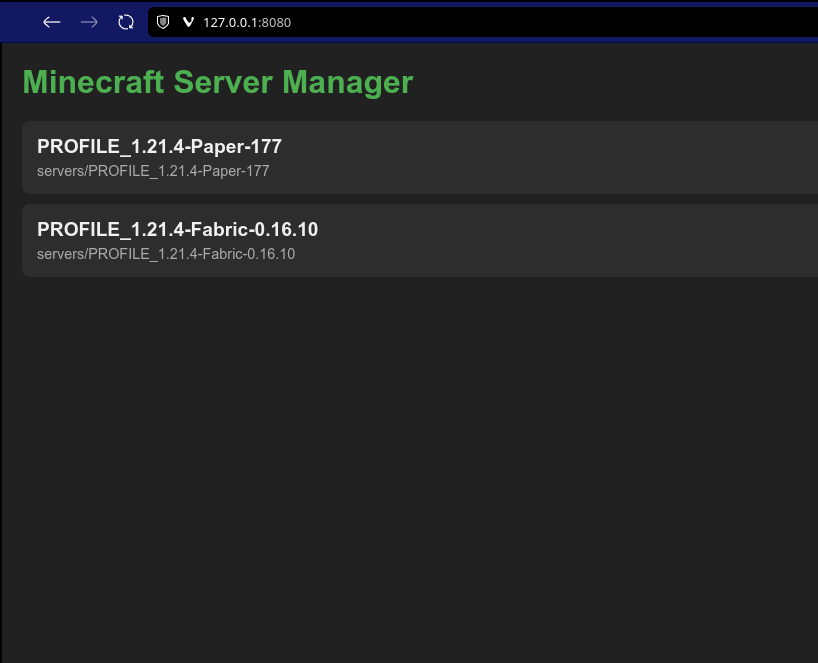
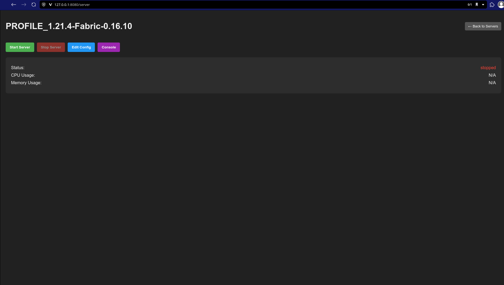
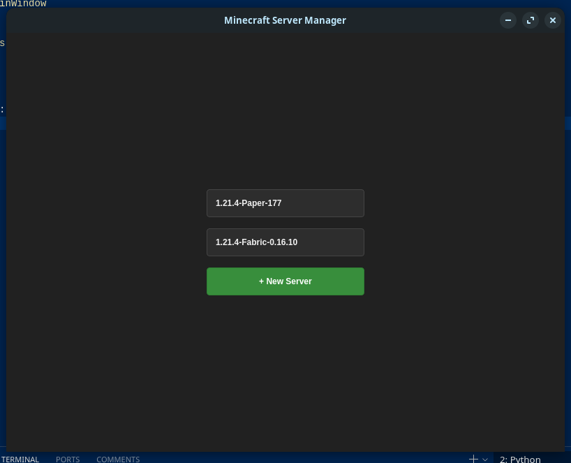
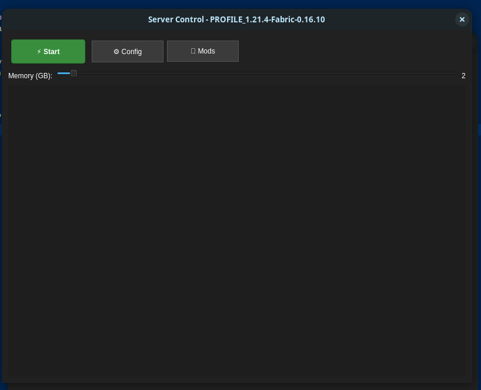

# MC-Server-mgr 1.9

## A Python Qt5 Application for Managing Minecraft Servers

MC-Server-mgr provides a simple graphical interface to create, configure, and manage local Minecraft servers.

### Features:
- Create new server instances for Vanilla, Paper, and Fabric
- Configure server settings through the GUI
- Allocate custom memory to server instances
- Browse and install mods directly from Modrinth
- Monitor server performance and logs
- Web UI for remote server management
- Automatic Java detection

### System Requirements:
- Python 3.6+
- PyQt5
- OpenJDK 17+ (Java)
- 4GB+ RAM recommended

### Tested On:
- Zorin OS 17.2 (Linux)
- Windows 10 Home 22H2

### Getting Started:
1. Clone the repository
2. Install dependencies: `pip install -r requirements.txt`
3. Run the application: `python app.py`
4. Create a new server profile or open an existing one
5. Configure server properties

### Web Interface:
Access the web UI at http://localhost:8080 to:
- View active server profiles
- Start/stop servers
- Access the console
- Edit configuration files

### Recent Updates:
- Added web UI for remote management
- Improved Modrinth integration
- Enhanced memory allocation controls
- Added automatic Java version detection
- Multi-platform support (Windows/Linux)

### License - MIT Liscense

This application is provided as open source software. When using it to run Minecraft servers, you must adhere to the [Minecraft EULA](https://www.minecraft.net/en-us/eula).

## Screenshots:
### WebGUI

### AppGUI

